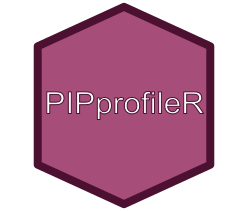

<p align="center"></p>

------

PIPprofileR is a tool to easily generate and explore Profiles of Percent Identical Positions from a fasta file (nucloetide or peptide sequences).

## PIPprofileR & Docker
The PIPprofiler application was developed with Docker and the image containing R and all necessary libraries is available online ([here](https://hub.docker.com/repository/docker/tdenecker/pip-profiler)).
Using PIPprofiler by this method guarantees reproducibility of the analyses.

### Requirements

We use Docker to develop and manage PIPprofileR. We invite you to verify that the
following requirements are correctly satisfied before trying to bootstrap the
application:

* [Docker 1.12.6+](https://docs.docker.com/engine/installation/)

> We recommend you to follow Docker's official documentations to install
required docker tools (see links above).To help you, explanatory videos for each
operating system are available [here](https://www.bretfisher.com/installdocker/)

**Docker must be on for the duration of PIPprofileR use.**

### Quick start

Have you read the "Requirements" section above?

#### PIPprofileR project installation

Download the zip file ([here](https://github.com/IFB-ElixirFr/PIPprofileR/archive/main.zip)), extract this file and copy the obtained folder where you want on your computer. Note that if you move the folder, the installation procedure will have to be redone.

**Reminder** : Docker must always be switched on for any installation and use of PIPprofileR !

##### Windows installation

**IMPORTANT** : PIPprofileR needs Docker. It will only be possible to install on **Windows 10**.

In this folder, you will find a file named INSTALLATION_WINDOWS.bat. By double clicking on it, the installation will begin. This may take a little time depending on the quality of your internet connection. When the installation is completed, a new file will appear. They allow to launch the PIPprofileR applications.

##### Mac OsX installation

**In command line**

[Open a terminal](https://www.youtube.com/watch?v=QROX039ckO8) and run these commands:

``` bash
git clone https://github.com/IFB-ElixirFr/PIPprofileR.git
cd PIPprofileR
sudo ./INSTALLATION_MAC.sh
```

The installation will begin. This may take a little time depending on the quality of your internet connection. When the installation is completed, a new file will appear. They allow to launch the PIPprofileR applications. Once the installation is complete, use this command to launch PIPprofileR:

``` bash
./PIPprofileR.sh
```

**NOTE**

You can also double click the file PIPprofileR.sh. In this situation a small manipulation is required (only once). In the Finder, right-click the file PIPprofileR.sh and select "Open with" and then "Other...".

You can select the application you want the file to be execute with. In this case it should be the Terminal. To be able to select the Terminal, you have to switch from "Recommended Applications" to "All Applications"  (the Terminal.app application can be found in the Utilities folder).

Check "Always Open With" and after clicking OK you should be able to execute you SHELL script by simply double-clicking it.

##### Linux installation

**In command line**

[Open a terminal](https://linuxconfig.org/how-to-open-a-terminal-on-ubuntu-bionic-beaver-18-04-linux) and run these commands:

```
git clone https://github.com/IFB-ElixirFr/PIPprofileR.git
cd PIPprofileR
sudo ./INSTALLATION_LINUX.sh
```
Once the installation is complete, use this command to launch PIPprofileR:
```
sudo ./PIPprofileR.sh
```

#### PIPprofileR application utilisation

Double click on PIPprofileR file (Windows / MacOS X) or launch the command line (Linux) and open your internet browser, typing the following url http://localhost:3838/ and it should work.

**NOTE** (MAC users) : You may need to repeat the same manipulation as for the installation file (only once).

#### Data to test application

A dataset is available [here]('https://github.com/IFB-ElixirFr/PIPprofileR/tree/main/inst/application/dataExample'). You can use it to see the file architecture and test the different options available.

## PIPprofileR & R

PIPprofileR is available as an R package. You can install it as follows: 

``` R
# install.packages('devtools', repos='https://cran.rstudio.com/', dependencies = TRUE)

library(devtools)
install_github('IFB-ElixirFr/PIPprofileR')

PIPprofileR::shiny_application(port = 3838, host = '0.0.0.0')
```

**Warning** : The packages may be different from those used during the development of the application. This method does not guarantee reproducibility.

## PIPprofileR & ShinyProxy

The limitation of the previous approaches is that the launch of the Shiny application is only done on a CPU. When several users are connected, performance drops sharply. One solution is to use [Shinyproxy](https://www.shinyproxy.io/).

Shinyproxy is a java application that allows to deploy Shiny applications without any limit, either in number of applications or in number of users. The only limit is the resources you have at your disposal to run this service (CPU and RAM).

When the user connects to the Shinyproxy set up, the user chooses the application among the available Shiny applications. A container docker of the application is then launched and the user is redirected to the application.

This approach has been tested in an [ubuntu 20.04 VM](https://biosphere.france-bioinformatique.fr/catalogue/appliance/173/) in the [IFB cloud](https://www.france-bioinformatique.fr/cloud-ifb/). 

### Download configuration files

``` bash
mkdir shinyProxy
cd shinyProxy/

wget https://raw.githubusercontent.com/IFB-ElixirFr/PIPprofileR/main/shinyProxy/Dockerfile
wget https://raw.githubusercontent.com/IFB-ElixirFr/PIPprofileR/main/shinyProxy/application.yml
```

### Build docker network

``` bash
docker network create sp-network
```

### Build docker Shinyproxy image

``` bash
docker build -t shinyproxy .
```

### Import PIPprofileR image

``` bash
docker pull tdenecker/pip-profiler
```

### Run PIPprofileR

``` bash
sudo docker run -d -v /var/run/docker.sock:/var/run/docker.sock --net sp-network -p 443:80 shinyproxy
```

**WARNING** : The open port of the IFB cloud VMs is port 443 (which you can find in this part of command line `-p 443:80`). This port can change depending on the deployment location.

### Open application

If this method has been used in the IFB cloud VMs, Shiny proxi is available at https://XXX.XXX.XXX.XXX:443 where XXX.XXX.XXX.XXX is the IP address of the VM.

## Development

### Debug

During development or if server crashes (gray screen), you will probably need to get all messages (errors, warnings and notifications) in the R terminal.

Does the problem persist? Post an [Issues](https://github.com/IFB-ElixirFr/PIPprofileR/issues) and we will try to find a solution!

### Test modifications in Docker environnement

``` bash
docker run -it -p 3838:3838 -v ABSOLUTE_PATH_TO_PIPprofileR_FOLDER/inst/application:/home/ tdenecker/pip-profiler bash -c "R -e \"shiny::runApp('/home/', host='0.0.0.0', port=3838)\""
```

### Connect to a R session

``` bash
docker run -ti --rm tdenecker/pip-profiler R
```

**Warning**: nothing is saved in this session (package installation, ...)

## Documentation

The application comes with a wiki to help you best when using it. It is available [here](https://github.com/IFB-ElixirFr/PIPprofileR/wiki). This wiki is currently being written. 

## Citation
If you use PIPprofileR project, please cite us :

IFB-ElixirFr , **PIPprofileR**, (2020), GitHub repository, https://github.com/IFB-ElixirFr/PIPprofileR

## Contributors

- Thomas Denecker (ORCID [0000-0003-1421-7641](https://orcid.org/0000-0003-1421-7641))
- Hélène Chiapello (ORCID [0000-0001-5102-0632](https://orcid.org/0000-0001-5102-0632))
- Jacques van Helden (ORCID [0000-0002-8799-8584](https://orcid.org/0000-0002-8799-8584))

This application exploits and modifies a part of Jacques' code available [here](https://github.com/jvanheld/SARS-CoV-2_origins). 

## Contributing

Please, see the [CONTRIBUTING](CONTRIBUTING.md) file.

## Contributor Code of Conduct

Please note that this project is released with a [Contributor Code of
Conduct](http://contributor-covenant.org/). By participating in this project you
agree to abide by its terms. See [CODE_OF_CONDUCT](CODE_OF_CONDUCT.md) file.

## License

PIPprofileR is released under the BSD-3 License. See the bundled [LICENSE](LICENSE)
file for details.
