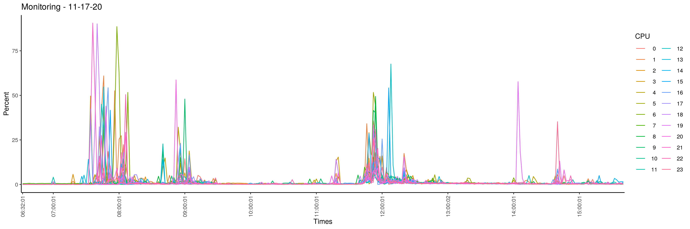
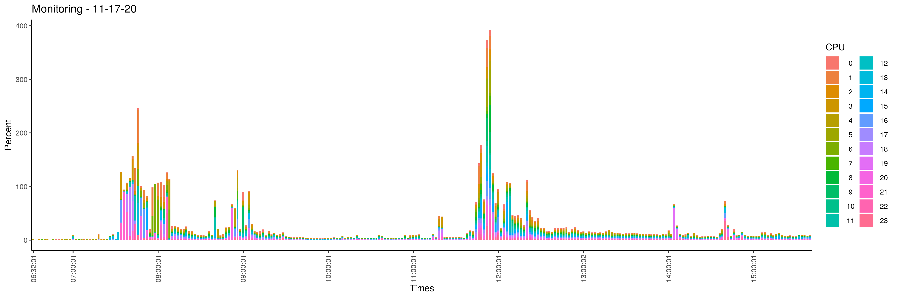

# PIPprofileR & ShinyProxy

## Why ShinyProxy ?

The limitation of the previous approaches is that the launch of the Shiny application is only done on a CPU. When several users are connected, performance drops sharply. One solution is to use [Shinyproxy](https://www.shinyproxy.io/).

Shinyproxy is a java application that allows to deploy Shiny applications without any limit, either in number of applications or in number of users. The only limit is the resources you have at your disposal to run this service (CPU and RAM).

When the user connects to the Shinyproxy set up, the user chooses the application among the available Shiny applications. A container docker of the application is then launched and the user is redirected to the application.

This approach has been tested in an [ubuntu 20.04 VM](https://biosphere.france-bioinformatique.fr/catalogue/appliance/173/) in the [IFB cloud](https://www.france-bioinformatique.fr/cloud-ifb/).

## Deployment of ShinyProxy in a vm of the IFB cloud

### 1- Download configuration files

``` bash
mkdir shinyProxy
cd shinyProxy/

wget https://raw.githubusercontent.com/IFB-ElixirFr/PIPprofileR/main/shinyProxy/Dockerfile
wget https://raw.githubusercontent.com/IFB-ElixirFr/PIPprofileR/main/shinyProxy/application.yml
```

### 2- Build docker network

``` bash
docker network create sp-network
```

### 3- Build docker Shinyproxy image

``` bash
docker build -t shinyproxy .
```

### 4- Import PIPprofileR image

``` bash
docker pull tdenecker/pip-profiler
```

### 5- Run PIPprofileR

``` bash
sudo docker run -d -v /var/run/docker.sock:/var/run/docker.sock --net sp-network -p 443:80 shinyproxy
```

**WARNING** : The open port of the IFB cloud VMs is port 443 (which you can find in this part of command line `-p 443:80`). This port can change depending on the deployment location.

### Open application

If this method has been used in the IFB cloud VMs, Shiny proxi is available at https://XXX.XXX.XXX.XXX:443 where XXX.XXX.XXX.XXX is the IP address of the VM.

## Monitoring with sar (sysstat)

### Installation & configuration
This documentation is based on a documentation available online [here](https://www.crybit.com/sysstat-sar-on-ubuntu-debian/).

#### Installation

``` bash
apt-get install sysstat
```

#### Configuration

**1- Modify the file  `/etc/default/sysstat`**
  
``` bash
nano /etc/default/sysstat
```

Content of the file after modification :

``` text
#
# Default settings for /etc/init.d/sysstat, /etc/cron.d/sysstat
# and /etc/cron.daily/sysstat files
#

# Should sadc collect system activity informations? Valid values
# are "true" and "false". Please do not put other values, they
# will be overwritten by debconf!
ENABLED="true"
```

**2- Modify the file  `/etc/cron.d/sysstat`**

``` bash
nano /etc/cron.d/sysstat  


Replace `5-55/10 * * * * root command -v debian-sa1 > /dev/null && debian-sa1 1 1` with `*/2 * * * * root command -v debian-sa1 > /dev/null && debian-sa1 1 1`.

Thus, every two minutes (instead of 10), the system statistics will be recorded.

**3- Restart sar**

``` bash
service sysstat restart
```

### Generate monitoring plot 

#### 1- Get script

``` bash
wget https://raw.githubusercontent.com/IFB-ElixirFr/PIPprofileR/main/shinyProxy/monitoring.R
wget https://raw.githubusercontent.com/IFB-ElixirFr/PIPprofileR/main/shinyProxy/monitoring.sh
```

#### 2- Run

``` bash
bash monitoring.sh
```

In this documentation, we use the R available in the PIPprofileR docker image. This monitoring script only needs R with the ggplot package installed(`install.packages("ggplot2")`) to work. The different steps are : 

``` bash
### Write monitoring file
sar -P ALL > monitoring.txt

### Remove space and create a tsv file
unexpand -a monitoring.txt > monitoring.tsv

### Run Script R in docker piprofiler
docker run -it -v ${PWD}:/home/ tdenecker/pip-profiler bash -c "Rscript /home/monitoring.R"
```

#### 3- Get Results

Two graphs have been generated and can be retrieved by a scp :

- `monitoring_barplot_XX-XX-XX.png`
- `monitoring_profile_XX-XX-XX.png`

where `XX-XX-XX` is the date.

#### Monitoring a specific day

``` bash
sar -P ALL -f /var/log/sysstat/sa17 > monitoring.txt
```

where sa17 is the 17th day of the month.

#### 4- Exemples d'utilisation

**Profile**

<p align="center"></p>

**Barplot**

<p align="center"></p>